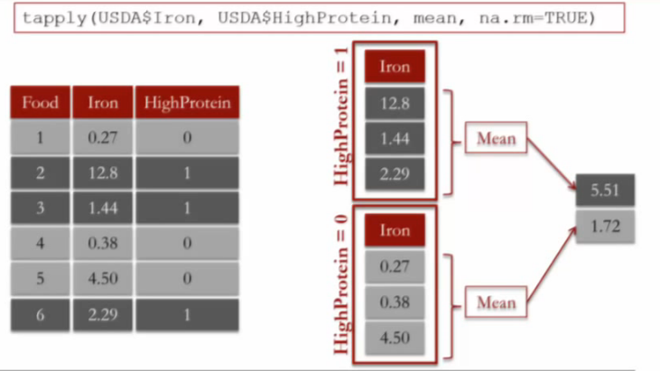

This is an [R Markdown](http://rmarkdown.rstudio.com) Notebook. When you execute code within the notebook, the results appear beneath the code. 

Try executing this chunk by clicking the *Run* button within the chunk or by placing your cursor inside it and pressing *Ctrl+Shift+Enter*. 

```{r}
plot(cars)
```

Add a new chunk by clicking the *Insert Chunk* button on the toolbar or by pressing *Ctrl+Alt+I*.

When you save the notebook, an HTML file containing the code and output will be saved alongside it (click the *Preview* button or press *Ctrl+Shift+K* to preview the HTML file).

Run this command when you are working on any lectures or exercises that might depend on the English language (for example, the names for the days of the week).
```{r}
Sys.setlocale("LC_ALL", "C")
```

```{r}
seq(0,100,2)

```

rbind() combine dataframes by stacking rows

```{r}
getwd()
WHO=read.csv("C:\\Users\\WALLI\\Desktop\\Di\\edx\\Analytic Edge\\WHO.csv")
str(WHO)

```
```{r}
summary(WHO)
which.min(WHO$Under15)
WHO$Country[86]
WHO$Country[which.min(WHO$Over60)]

```

```{r}
WHO_Europe = subset(WHO, Region  =="Europe")
str(WHO_Europe)
```

```{r}
hist(WHO$CellularSubscribers)
```

```{r}
boxplot(WHO$LifeExpectancy ~ WHO$Region, xlab = " ",  ylab="life expectancy", main = "Life expectancy of countries by region")
```
Outliers computed as any points greater than the third quartile plus 1.5*IQR, or less than the first quartile minus 1.5*IQR. 
```{r}
table(WHO$Region)
tapply(WHO$Over60, WHO$Region, mean)
```
```{r}
tapply(WHO$LiteracyRate, WHO$Region, min, na.rm = TRUE)
```
```{r}
USDA=read.csv("C:\\Users\\WALLI\\Desktop\\Di\\edx\\Analytic Edge\\USDA.csv")
```
```{r}
hist(USDA$VitaminC, xlab = " Vitamin C(mg)", xlim = c(0,100), breaks = 100)
```
breaks = 100 apply for entire range `r max(USDA$VitaminC, na.rm = TRUE)` - `r min(USDA$VitaminC, na.rm = TRUE)` so we get 2400/100 =

Adding new variable
```{r}
HighSodium = as.numeric(USDA$Sodium > mean(USDA$Sodium, na.rm= TRUE))
str(HighSodium)
USDA$HighSodium = HighSodium
```



```{r}
USDA$HighFat = as.numeric(USDA$TotalFat > mean(USDA$TotalFat, na.rm= TRUE))
table(USDA$HighSodium, USDA$HighFat)
tapply(USDA$VitaminC,USDA$HighSodium, summary, na.rm = TRUE)
```

Date conversion
```{r}
mvt=read.csv("C:/Users/WALLI/Desktop/Di/edx/Analytic Edge/mvtWeek1.csv")
DateConvert = as.Date(strptime(mvt$Date, "%m/%d/%y %H:%M"))
summary(DateConvert)
```

```{r}
mvt$Month = months(DateConvert)

mvt$Weekday = weekdays(DateConvert)
mvt$Date = DateConvert
```
```{r}
sort(table(mvt$LocationDescription))
```

```{r}
Top5=subset(mvt, mvt$LocationDescription %in% c("STREET", "PARKING LOT/GARAGE(NON.RESID.)", "ALLEY", "GAS STATION", "DRIVEWAY - RESIDENTIAL" ))
Top5$LocationDescription = factor(Top5$LocationDescription)
```
```{r}
plot(CocaCola$Date, CocaCola$StockPrice, type = "l", col = "red")
lines(ProcterGamble$Date, ProcterGamble$StockPrice, col="blue") 
abline(v=as.Date(c("2000-03-01")), lwd=2)
```


```{r}
tapply(IBM$StockPrice, months(IBM$Date), summary)
```

Analysing NA values
```{r}
CPS=read.csv("C:/Users/WALLI/Desktop/Di/edx/Analytic Edge/CPSData.csv")
table(CPS$Sex, is.na(CPS$Married))
```

Computing proportions
```{r}
tapply(is.na(CPS$MetroAreaCode), CPS$State, mean)

```


```{r}
sort(tapply(CPS$Race == "Asian" ,CPS$MetroArea,  mean))
```


Merging

```{r}
MetroAreaMap=read.csv("C:/Users/WALLI/Desktop/Di/edx/Analytic Edge/MetroAreaCodes.csv")
CPS = merge(CPS, MetroAreaMap, by.x="MetroAreaCode", by.y="Code", all.x=TRUE)

```

The first two arguments determine the data frames to be merged (they are called "x" and "y", respectively, in the subsequent parameters to the merge function). by.x="MetroAreaCode" means we're matching on the MetroAreaCode variable from the "x" data frame (CPS), while by.y="Code" means we're matching on the Code variable from the "y" data frame (MetroAreaMap). Finally, all.x=TRUE means we want to keep all rows from the "x" data frame (CPS), even if some of the rows' MetroAreaCode doesn't match any codes in MetroAreaMap (for those familiar with database terminology, this parameter makes the operation a left outer join instead of an inner join).


To obtain the number of TRUE values in a vector of TRUE/FALSE values, you can use the sum() function. For instance, sum(c(TRUE, FALSE, TRUE, TRUE)) is 3. Therefore, we can obtain counts of people born in a particular country living in a particular metropolitan area with:

```{r}
sort(tapply(CPS$Country == "India", CPS$MetroArea, sum, na.rm=TRUE))
```


Linera regression 

```{r}
wine= read.csv("C:/Users/WALLI/Desktop/Di/edx/Analytic Edge/wine.csv")
model = lm(Price ~ AGST, data = wine )
summary(model)
```

SSE
```{r}
SSE=sum(model$residuals^2)
SSE
```

Correlation 

```{r}
cor(wine$WinterRain, wine$Price)
cor(wine)
```

Prediction

```{r}
wineTest=read.csv("C:/Users/WALLI/Desktop/Di/edx/Analytic Edge//wine_test.csv")
predictTest=predict(model, newdata = wineTest)
predictTest
SSE=sum((wineTest$Price - predictTest)^2)
SST=sum((wineTest$Price - mean(wine$Price))^2)
1-SSE/SST
```

Change reference level for factor variable
```{r}
pisa_train = read.csv("C:/Users/WALLI/Desktop/Di/edx/Analytic Edge/pisa2009train.csv")
pisa_test= read.csv("C:/Users/WALLI/Desktop/Di/edx/Analytic Edge/pisa2009test.csv")
pisa_train$raceeth = relevel(pisa_train$raceeth, "White")

pisa_test$raceeth = relevel(pisa_test$raceeth, "White")
```

RMSE
```{r}
pisa_test_pr=predict(lm_pisa, newdata = pisa_test)
```

Library for spliting data into data and test
```{r}
library(caTools)
quality = read.csv("C:/Users/WALLI/Desktop/Di/edx/Analytic Edge/quality.csv")
# Randomly split data
set.seed(88)
split = sample.split(quality$PoorCare, SplitRatio = 0.75)
split

# Create training and testing sets
qualityTrain = subset(quality, split == TRUE)
qualityTest = subset(quality, split == FALSE)
```

Logistic Regression Model
```{r}
QualityLog = glm(PoorCare ~ OfficeVisits + Narcotics, data=qualityTrain, family=binomial)
summary(QualityLog)
predictTrain = predict(QualityLog, type="response")
```

Analyze predictions
```{r}
summary(predictTrain)

tapply(predictTrain, qualityTrain$PoorCare, mean)
```

# Confusion matrix for threshold of 0.5

```{r}
table(qualityTrain$PoorCare, predictTrain > 0.5)
```


Generate ROC curve
```{r}
library(ROCR)
ROCRpred = prediction(predictTrain, qualityTrain$PoorCare)
# Performance function
ROCRperf = performance(ROCRpred, "tpr", "fpr")

# Plot ROC curve
plot(ROCRperf)

# Add colors
plot(ROCRperf, colorize=TRUE)

# Add threshold labels 
plot(ROCRperf, colorize=TRUE, print.cutoffs.at=seq(0,1,by=0.1), text.adj=c(-0.2,1.7))
```


Computing AUC
The AUC of a model has the following nice interpretation: given a random patient from the dataset who actually received poor care, and a random patient from the dataset who actually received good care, the AUC is the perecentage of time that our model will classify which is which correctly.
```{r}
predictTest = predict(QualityLog, type="response", newdata=qualityTest)
ROCRpredTest = prediction(predictTest, qualityTest$PoorCare)

auc = as.numeric(performance(ROCRpredTest, "auc")@y.values)
```


```{r}

# Multiple imputation
polling = read.csv("C:/Users/WALLI/Desktop/Di/edx/Analytic Edge/PollingData.csv")
simple = polling[c("Rasmussen", "SurveyUSA", "PropR", "DiffCount")]
summary(simple)
set.seed(144)
library("mice")
imputed = complete(mice(simple))
summary(imputed)
polling$Rasmussen = imputed$Rasmussen
polling$SurveyUSA = imputed$SurveyUSA
summary(polling)

```

Remove variables from datasets

```{r}
# To do this, we can use the following trick. First define a vector of variable names called nonvars #- these are the variables that we won't use in our model.
songs=read.csv("C:/Users/WALLI/Desktop/Di/edx/Analytic Edge/songs.csv")
songtrain=subset(songs, songs$year <= 2009)
songtest=subset(songs, songs$year > 2009)
nonvars = c("year", "songtitle", "artistname", "songID", "artistID")

#To remove these variables from your training and testing sets, type the following commands in your R #console:

songtrain = songtrain[ , !(names(songtrain) %in% nonvars) ]

songtest = songtest[ , !(names(songtest) %in% nonvars) ]
```

Substract variable from model
```{r}
SongsLog2 = glm(Top10 ~ . - loudness, data=songtrain, family=binomial)
```
But this approach (subtracting the variable from the model formula) will always work when you want to remove *numeric variables*.


Trees
```{r}
stevens = read.csv("C:\\Users\\WALLI\\Desktop\\Di\\edx\\Analytic Edge\\stevens.csv")
library(caTools)
set.seed(3000)
spl = sample.split(stevens$Reverse, SplitRatio = 0.7)
Train = subset(stevens, spl==TRUE)
Test = subset(stevens, spl==FALSE)
library(rpart)
library(rpart.plot)

# CART model
StevensTree = rpart(Reverse ~ Circuit + Issue + Petitioner + Respondent + LowerCourt + Unconst, data = Train, method="class", minbucket=25)
prp(StevensTree)

```

```{r}
# ROC curve
library(ROCR)

PredictROC = predict(StevensTree, newdata = Test)
PredictROC

pred = prediction(PredictROC[,2], Test$Reverse)
perf = performance(pred, "tpr", "fpr")
plot(perf)

```


Random Forest
```{r}
library(randomForest)
# Build random forest model
StevensForest = randomForest(Reverse ~ Circuit + Issue + Petitioner + Respondent + LowerCourt + Unconst, data = Train, ntree=200, nodesize=25 )
#get warning

# Convert outcome to factor
Train$Reverse = as.factor(Train$Reverse)
Test$Reverse = as.factor(Test$Reverse)

# Try again
StevensForest = randomForest(Reverse ~ Circuit + Issue + Petitioner + Respondent + LowerCourt + Unconst, data = Train, ntree=200, nodesize=25 )

```
Cross-validating
```{r}
# Define cross-validation experiment
library(caret)

library(e1071)
numFolds = trainControl( method = "cv", number = 10 )
cpGrid = expand.grid( .cp = seq(0.01,0.5,0.01)) 

# Perform the cross validation
train(Reverse ~ Circuit + Issue + Petitioner + Respondent + LowerCourt + Unconst, data = Train, method = "rpart", trControl = numFolds, tuneGrid = cpGrid )
# Create a new CART model
# Accuracy was used to select the optimal model using  the largest value.
# The final value used for the model was cp = 0.18.
StevensTreeCV = rpart(Reverse ~ Circuit + Issue + Petitioner + Respondent + LowerCourt + Unconst, data = Train, method="class", cp = 0.18)

```

CART models
```{r}
Claims = read.csv("C:\\Users\\WALLI\\Desktop\\Di\\edx\\Analytic Edge\\ClaimsData.csv")

# Split the data
library(caTools)

set.seed(88)

spl = sample.split(Claims$bucket2009, SplitRatio = 0.6)

ClaimsTrain = subset(Claims, spl==TRUE)

ClaimsTest = subset(Claims, spl==FALSE)
```

```{r}
# Penalty Matrix
PenaltyMatrix = matrix(c(0,1,2,3,4,2,0,1,2,3,4,2,0,1,2,6,4,2,0,1,8,6,4,2,0), byrow=TRUE, nrow=5)

PenaltyMatrix

# Penalty Error of Baseline Method
as.matrix(table(ClaimsTest$bucket2009, ClaimsTest$bucket2008))*PenaltyMatrix

sum(as.matrix(table(ClaimsTest$bucket2009, ClaimsTest$bucket2008))*PenaltyMatrix)/nrow(ClaimsTest)

```

```{r}
# CART model
# New CART model with loss matrix
ClaimsTree = rpart(bucket2009 ~ age + alzheimers + arthritis + cancer + copd + depression + diabetes + heart.failure + ihd + kidney + osteoporosis + stroke + bucket2008 + reimbursement2008, data=ClaimsTrain, method="class", cp=0.00005, parms=list(loss=PenaltyMatrix))


#prp(ClaimsTree)

```


```{r}
# Plot observations
plot(boston$LON, boston$LAT)

# Tracts alongside the Charles River
points(boston$LON[boston$CHAS==1], boston$LAT[boston$CHAS==1], col="blue", pch=19)

# Plot MIT
points(boston$LON[boston$TRACT==3531],boston$LAT[boston$TRACT==3531],col="red", pch=20)
# Plot polution
summary(boston$NOX)
points(boston$LON[boston$NOX>=0.55], boston$LAT[boston$NOX>=0.55], col="green", pch=20)

# Plot prices
plot(boston$LON, boston$LAT)
summary(boston$MEDV)
points(boston$LON[boston$MEDV>=21.2], boston$LAT[boston$MEDV>=21.2], col="red", pch=20)
```

```{r}


```

CP parameter:


As we discussed in lecture, random forest models work by building a large collection of trees. As a result, we lose some of the interpretability that comes with CART in terms of seeing how predictions are made and which variables are important. However, we can still compute metrics that give us insight into which variables are important.

One metric that we can look at is the number of times, aggregated over all of the trees in the random forest model, that a certain variable is selected for a split. To view this metric, run the following lines of R code (replace "MODEL" with the name of your random forest model):

vu = varUsed(MODEL, count=TRUE)

vusorted = sort(vu, decreasing = FALSE, index.return = TRUE)

dotchart(vusorted$x, names(MODEL$forest$xlevels[vusorted$ix]))

A different metric we can look at is related to "impurity", which measures how homogenous each bucket or leaf of the tree is. In each tree in the forest, whenever we select a variable and perform a split, the impurity is decreased. Therefore, one way to measure the importance of a variable is to average the reduction in impurity, taken over all the times that variable is selected for splitting in all of the trees in the forest. To compute this metric, run the following command in R (replace "MODEL" with the name of your random forest model):

varImpPlot(MODEL)


Text Analytics

```{r}
tweets = read.csv("C:\\Users\\DBelyakov\\education\\Analytic Edge\\tweets.csv", stringsAsFactors=FALSE)
tweets$Negative = as.factor(tweets$Avg <= -1)
library(tm)
library(SnowballC)

# Create corpus
corpus = VCorpus(VectorSource(tweets$Tweet)) 

# Look at corpus
corpus
corpus[[1]]$content


# Convert to lower-case

corpus = tm_map(corpus, content_transformer(tolower))

corpus[[1]]$content

# Remove punctuation

corpus = tm_map(corpus, removePunctuation)

corpus[[1]]$content

# Look at stop words 
stopwords("english")[1:10]

# Remove stopwords and apple

corpus = tm_map(corpus, removeWords, c("apple", stopwords("english")))

corpus[[1]]$content

# Stem document 

corpus = tm_map(corpus, stemDocument)

corpus[[1]]$content
```

```{r}
frequencies = DocumentTermMatrix(corpus)
inspect(frequencies[1000:1005,505:515])
findFreqTerms(frequencies, lowfreq=20)
```
# Remove sparse terms
```{r}
sparse = removeSparseTerms(frequencies, 0.995)
sparse
```

```{r}
# Convert to a data frame

tweetsSparse = as.data.frame(as.matrix(sparse))

# Make all variable names R-friendly

colnames(tweetsSparse) = make.names(colnames(tweetsSparse))

# Add dependent variable

tweetsSparse$Negative = tweets$Negative
```


123
