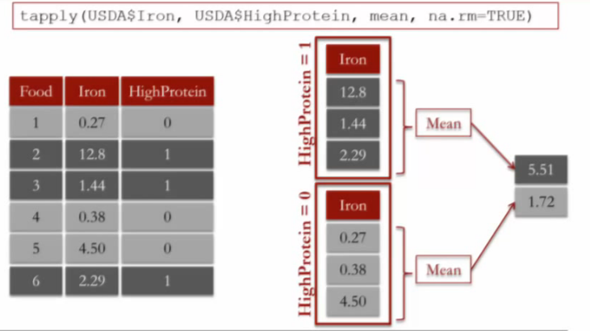

This is an [R Markdown](http://rmarkdown.rstudio.com) Notebook. When you execute code within the notebook, the results appear beneath the code. 

Try executing this chunk by clicking the *Run* button within the chunk or by placing your cursor inside it and pressing *Ctrl+Shift+Enter*. 

```{r}
plot(cars)
```

Add a new chunk by clicking the *Insert Chunk* button on the toolbar or by pressing *Ctrl+Alt+I*.

When you save the notebook, an HTML file containing the code and output will be saved alongside it (click the *Preview* button or press *Ctrl+Shift+K* to preview the HTML file).

Run this command when you are working on any lectures or exercises that might depend on the English language (for example, the names for the days of the week).
```{r}
Sys.setlocale("LC_ALL", "C")
```

```{r}
seq(0,100,2)

```

rbind() combine dataframes by stacking rows

```{r}
getwd()
WHO=read.csv("C:\\Users\\WALLI\\Desktop\\Di\\edx\\Analytic Edge\\WHO.csv")
str(WHO)

```
```{r}
summary(WHO)
which.min(WHO$Under15)
WHO$Country[86]
WHO$Country[which.min(WHO$Over60)]

```

```{r}
WHO_Europe = subset(WHO, Region  =="Europe")
str(WHO_Europe)
```

```{r}
hist(WHO$CellularSubscribers)
```

```{r}
boxplot(WHO$LifeExpectancy ~ WHO$Region, xlab = " ",  ylab="life expectancy", main = "Life expectancy of countries by region")
```
Outliers computed as any points greater than the third quartile plus 1.5*IQR, or less than the first quartile minus 1.5*IQR. 
```{r}
table(WHO$Region)
tapply(WHO$Over60, WHO$Region, mean)
```
```{r}
tapply(WHO$LiteracyRate, WHO$Region, min, na.rm = TRUE)
```
```{r}
USDA=read.csv("C:\\Users\\WALLI\\Desktop\\Di\\edx\\Analytic Edge\\USDA.csv")
```
```{r}
hist(USDA$VitaminC, xlab = " Vitamin C(mg)", xlim = c(0,100), breaks = 100)
```
breaks = 100 apply for entire range `r max(USDA$VitaminC, na.rm = TRUE)` - `r min(USDA$VitaminC, na.rm = TRUE)` so we get 2400/100 =

Adding new variable
```{r}
HighSodium = as.numeric(USDA$Sodium > mean(USDA$Sodium, na.rm= TRUE))
str(HighSodium)
USDA$HighSodium = HighSodium
```



```{r}
USDA$HighFat = as.numeric(USDA$TotalFat > mean(USDA$TotalFat, na.rm= TRUE))
table(USDA$HighSodium, USDA$HighFat)
tapply(USDA$VitaminC,USDA$HighSodium, summary, na.rm = TRUE)
```

Date conversion
```{r}
mvt=read.csv("./edx/Analytic Edge/mvtWeek1.csv")
DateConvert = as.Date(strptime(mvt$Date, "%m/%d/%y %H:%M"))
summary(DateConvert)
```

```{r}
mvt$Month = months(DateConvert)

mvt$Weekday = weekdays(DateConvert)
mvt$Date = DateConvert
```
```{r}
sort(table(mvt$LocationDescription))
```

```{r}
Top5=subset(mvt, mvt$LocationDescription %in% c("STREET", "PARKING LOT/GARAGE(NON.RESID.)", "ALLEY", "GAS STATION", "DRIVEWAY - RESIDENTIAL" ))
Top5$LocationDescription = factor(Top5$LocationDescription)
```
```{r}
plot(CocaCola$Date, CocaCola$StockPrice, type = "l", col = "red")
lines(ProcterGamble$Date, ProcterGamble$StockPrice, col="blue") 
abline(v=as.Date(c("2000-03-01")), lwd=2)
```


```{r}
tapply(IBM$StockPrice, months(IBM$Date), summary)
```

Analysing NA values
```{r}
table(CPS$Sex, is.na(CPS$Married))
```

Computing proportions
```{r}
tapply(is.na(CPS$MetroAreaCode), CPS$State, mean)

```


```{r}
sort(tapply(CPS$Race == "Asian" ,CPS$MetroArea,  mean))
```


Merging

```{r}
CPS = merge(CPS, MetroAreaMap, by.x="MetroAreaCode", by.y="Code", all.x=TRUE)

```

The first two arguments determine the data frames to be merged (they are called "x" and "y", respectively, in the subsequent parameters to the merge function). by.x="MetroAreaCode" means we're matching on the MetroAreaCode variable from the "x" data frame (CPS), while by.y="Code" means we're matching on the Code variable from the "y" data frame (MetroAreaMap). Finally, all.x=TRUE means we want to keep all rows from the "x" data frame (CPS), even if some of the rows' MetroAreaCode doesn't match any codes in MetroAreaMap (for those familiar with database terminology, this parameter makes the operation a left outer join instead of an inner join).
